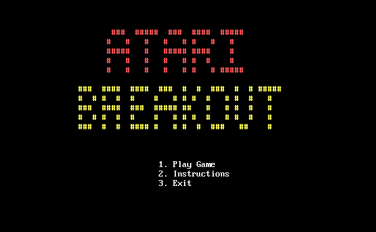
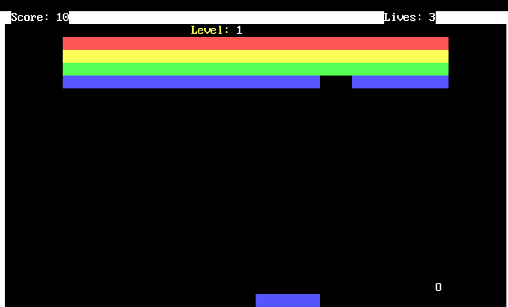

# BreakOut - 8086 Assembly Game 🎮

A retro arcade-style brick breaker game developed entirely in 16-bit 8086 Assembly Language (NASM). This project demonstrates low-level system programming, including direct hardware manipulation for graphics, sound, and input handling.

## 📸 Screenshots
| Main Menu | Gameplay |
|:---:|:---:|
|  |  |

## 🚀 Features
- **Direct Video Memory Rendering:** Bypasses BIOS interrupts for high-speed graphics by writing directly to VGA video memory at address `0xB800`.
- **Custom Sound Engine:** Generates square wave audio by directly programming the Programmable Interval Timer (PIT) ports `0x43` and `0x42` and the PPI port `0x61`.
- **Physics Engine:** Implements collision detection logic for the ball, paddle, and bricks, including angle calculations for paddle hits.
- **Mouse & Keyboard Support:** Hybrid input system using Interrupt `0x33` for mouse tracking and `0x16` for keyboard control.
- **State Management:** Fully implemented state machine handling the Main Menu, Gameplay Loop, Win/Loss conditions, and Instruction screens.

## 🛠️ How to Run
1. **Prerequisite:** You need **DOSBox** installed on your machine.
2. **Download:** Get the `game.com` file from this repository.
3. **Run:** Drag and drop `game.com` directly onto your DOSBox shortcut.
   
   *Alternatively, if using the command line:*
   ```bash
   mount c c:\path\to\game
   c:
   game.com